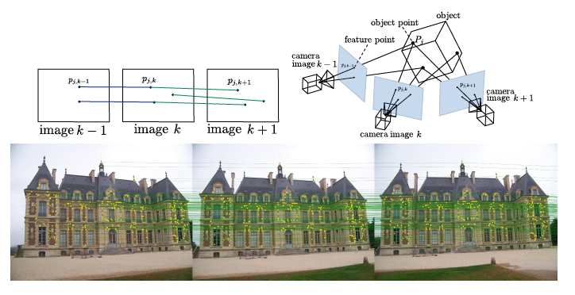
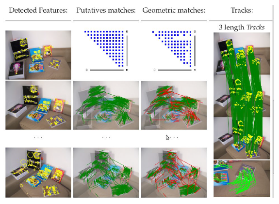

# track

The problem of feature points tracking is to follow the position of a characteristic point in a set of images.
These multi-view correspondences are called tracks.
Track identification in a set of images (ordered, or not) is an important task in computer vision.
It allows solving geometry-related problems like video stabilization, tracking, match-moving, image-stitching, structure from motion and odometry.


## Un/ordered feature tracking

Considering n pairwise feature correspondences as input we want sets of corresponding matching features across multiple images, as illustrated in the following figures with video frames.



The library provides an efficient solution to solve the union of all the pairwise correspondences.
It is the implementation of the CVMP12 paper "Unordered feature tracking made fast and easy" [TracksCVMP12].



Some comments about the data structure:

```
using namespace openMVG::matching;

// pairwise matches container:
PairWiseMatches map_Matches;

// Fil the pairwise correspondeces or load a series of pairwise matches from a file
PairedIndMatchImport("matches.f.txt", map_Matches);

//---------------------------------------
// Compute tracks from pairwise matches
//---------------------------------------
TracksBuilder tracksBuilder;
tracks::STLMAPTracks map_tracks;  // The track container
tracksBuilder.Build(map_Matches); // Build: Efficient fusion of correspondences
tracksBuilder.Filter();           // Filter: Remove track that have conflict
tracksBuilder.ExportToSTL(map_tracks); // Build tracks with STL compliant type

// In order to visit all the tracks, follow this code:
for (tracks::STLMAPTracks::const_iterator iterT = map_tracks.begin();
	iterT != map_tracks.end(); ++ iterT)
{
	const IndexT trackId = iterT->first;
	const tracks::submapTrack & track = iterT->second;
	for ( tracks::submapTrack::const_iterator iterTrack = track.begin();
	  iterTrack != track.end(); ++iterTrack)
	{
		const IndexT imageId = iterTrack->first;
		const IndexT featId = iterTrack->second;
		
		// Get the feature point
	}
}
```
